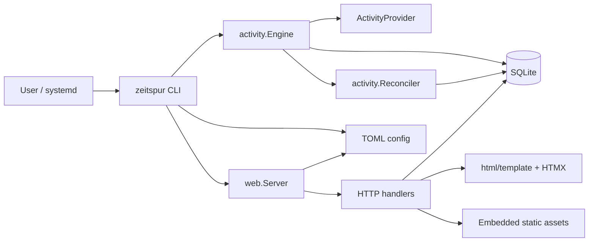
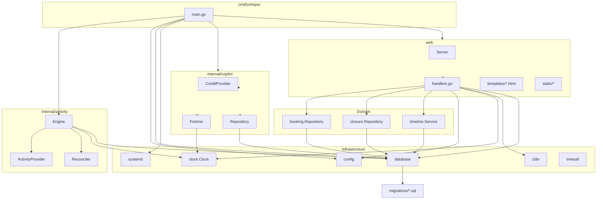
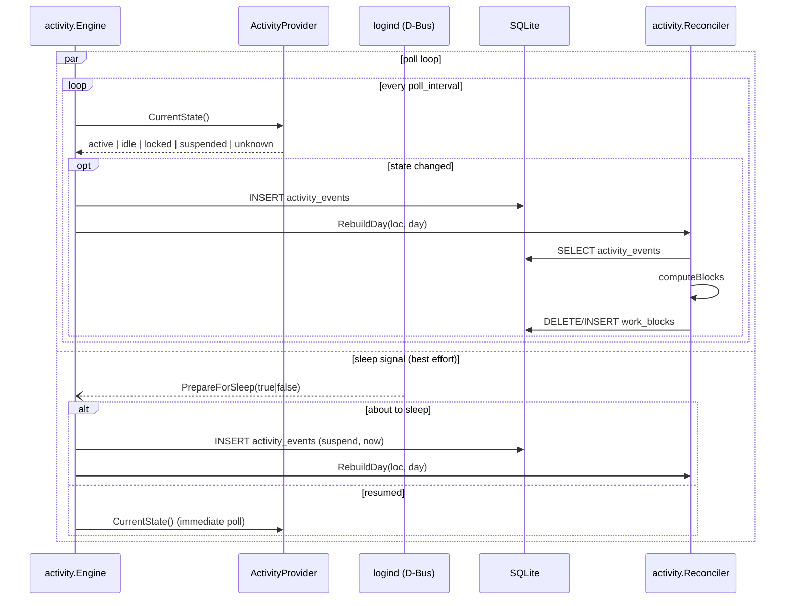
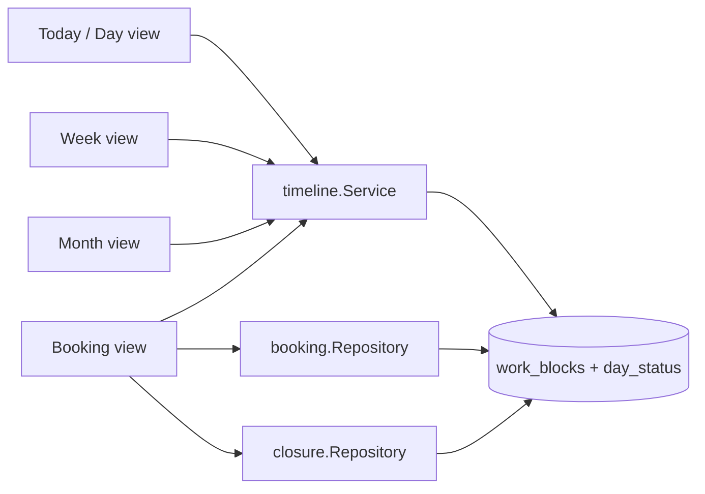
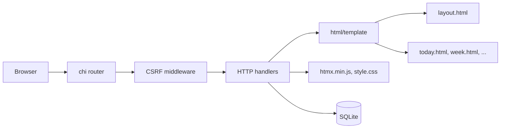
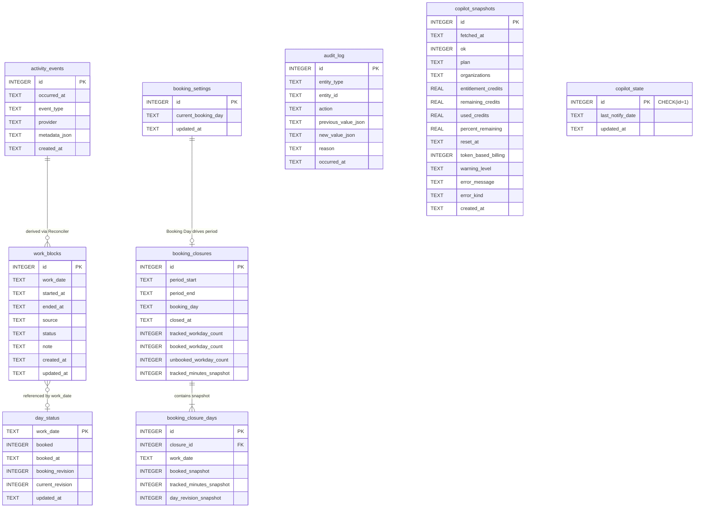
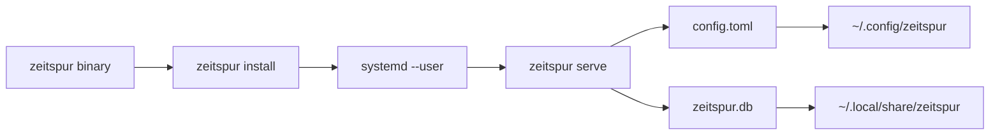

# Architecture

Zeitspur is a privacy-friendly, local Linux application for automatically tracking working activity. It is shipped as a single Go binary that includes the web UI, SQLite persistence, activity detection, and systemd user-service management. There is no Node.js or frontend build step.

## System Overview



The `zeitspur` binary has six subcommands: `serve`, `status`, `open`, `install`, `uninstall`, and `version`. `serve` is the runtime command used by the systemd user service. It starts the activity collection engine and the local HTTP server in the same process.

Key principles:

- **Single binary:** templates, CSS, HTMX, SQLite migrations, and the systemd unit template are embedded via `//go:embed`.
- **No CGO:** `CGO_ENABLED=0`, SQLite is pure Go via `modernc.org/sqlite`.
- **Local only:** the web UI binds to `127.0.0.1:8787` by default.
- **Event sourcing:** raw activity events are the source of truth; `work_blocks` are derived by the reconciler.
- **Privacy first:** only high-level state transitions are stored.

## Layer Boundaries



The codebase keeps three layers distinct:

1. **Capture (`internal/activity`, `internal/copilot`)** polls external state — local activity via D-Bus and GitHub Copilot credits via `gh` — and writes raw rows.
2. **Domain (`booking`, `closure`, `timeline`)** reads raw events and derived blocks and implements business rules.
3. **Presentation (`web`)** renders HTML and handles form posts; it never contains capture or calculation logic.

`scripts/boundaries.go` enforces these rules by checking every internal import. The only current exception is `web` importing `internal/activity` because the `ActivityProvider` contract still lives in the capture package. When that contract is moved to a dedicated package, the exception should be removed.

## Activity Detection And Event Flow



`ActivityProvider` is the seam between the engine and the desktop environment:

| Provider | File | Behaviour |
| --- | --- | --- |
| GNOME/Mutter | `internal/activity/gnome_provider.go` | Queries `org.gnome.Mutter.IdleMonitor` for idle time and `org.gnome.ScreenSaver` (falling back to `org.freedesktop.ScreenSaver`) for lock state. |
| Freedesktop | `internal/activity/freedesktop_provider.go` | Generic fallback that queries `org.freedesktop.ScreenSaver` and `org.kde.screensaver` for idle time and lock state, covering KDE and other freedesktop-compatible desktops. |
| Lock only | `internal/activity/lock_only_provider.go` | Uses logind lock state only. It reports unlocked sessions as active, so idle time is ignored while screen lock and suspend still end work blocks. |
| Mock | `internal/activity/mock.go` | Programmable state for tests and fallback when D-Bus is unavailable. |

At startup the CLI chooses providers based on `activity.mode`. In `idle_and_lock` mode it tries GNOME → Freedesktop, so KDE and other freedesktop-compatible desktops are used automatically when the GNOME-specific interfaces are not present. In `lock_only` mode it uses the lock-only provider.

The engine (`internal/activity/engine.go`) runs a ticker at `poll_interval`. On each tick it asks the provider for the current state and records an event only when the state changes:

- `active` is emitted whenever the user becomes active after `idle`, `locked`, or `suspended`.
- `idle` is emitted once `idle_threshold` has passed since the last activity in `idle_and_lock` mode; the timestamp is back-dated to the real idle start. `lock_only` mode does not emit idle events.
- `locked` / `unlocked` and `suspend` / `resume` map directly to lock and power events.
- `provider_error` is recorded once per consecutive failure with error metadata.

Suspend/resume detection has two layers, independent of the chosen `ActivityProvider`:

1. **Primary: logind signal.** `Engine.Run` subscribes to `org.freedesktop.login1.Manager.PrepareForSleep` on the system bus (`internal/activity/logind.go`'s `sleepWatcher`). `PrepareForSleep(true)` records a `suspend` event at the exact signal time; `PrepareForSleep(false)` (resume) triggers an immediate poll instead of waiting for the next tick, so the post-resume state and its timestamp are as accurate as possible. Subscribing is best-effort: if the system bus or logind is unavailable, the engine logs a warning and relies solely on layer 2.
2. **Fallback: polling gap detection.** `tick` also compares the wall-clock time since the last active tick to `idle_threshold + 2*poll_interval`. If that gap is exceeded, it retroactively inserts a `suspend` event at the last known active time. This catches suspends even if the signal above was missed or is unavailable, at the cost of a coarser (back-dated) timestamp.

Both layers only ever call `clock.Clock.Now()`, never `time.Now()` directly. This matters specifically for gap detection: `clock.System.Now()` strips the monotonic clock reading (`Round(0)`) before returning, because Go's monotonic clock is backed by `CLOCK_MONOTONIC` on Linux, which does not advance while the system is suspended. Without stripping it, `now.Sub(lastActiveAt)` would silently use the near-zero monotonic delta instead of the real wall-clock gap after a suspend/resume cycle, and the fallback in layer 2 would never trigger — which is exactly what happened in production before this was fixed.

The reconciler (`internal/activity/reconcile.go`) computes `work_blocks` from the event stream:

- A block starts on `active`, `unlocked`, or `resume`.
- A block ends on `idle`, `locked`, or `suspend`.
- Blocks that cross midnight are split per calendar day.
- Only `detected`/`active` blocks are replaced on each rebuild; manual blocks and ignored/deleted blocks are preserved.
- Ignored detected blocks are subtracted from newly computed detected blocks; if the user ignores the currently open block, later active ticks extend that ignored block instead of recreating it as active.

All state names are defined in `internal/activity/types.go`.

## Copilot Credit Tracking

```mermaid
flowchart LR
  gh[gh CLI] -->|gh api copilot_internal/user| provider[CreditProvider]
  provider --> fetcher[Fetcher]
  fetcher -->|every fetch_interval| repo[Repository]
  fetcher -->|after store| alerter[Alerter]
  repo --> db[(copilot_snapshots)]
  alerter --> state[(copilot_state)]
  alerter --> notify[Desktop Notification]
  web[/copilot] --> repo
```

`internal/copilot` is a second capture layer alongside `internal/activity`. A `Fetcher` polls a `CreditProvider` on a ticker (default hourly) and persists each result as a `copilot_snapshots` row. The default `GHCLIProvider` shells out to `gh api copilot_internal/user`, relying on the user's existing `gh auth login` credentials — Zeitspur stores no token. A failed fetch still records an `ok=0` row with the error message so the UI can surface it, and repeated identical failures are logged once on transition to avoid spamming the journal.

### Fetch error classification

A failed fetch is classified into a stable `ErrorKind` (`internal/copilot/fetcherror.go`) instead of surfacing gh's raw stderr. `classifyGHError` inspects the process error and the `(HTTP nnn)` marker gh appends to API failures:

| Kind | Trigger | Transient |
| --- | --- | --- |
| `unavailable` | HTTP 5xx (GitHub outage) | yes |
| `rate_limited` | HTTP 429, or 403 mentioning a rate limit | yes |
| `network` | transport errors, cancelled/timed-out context | yes |
| `auth` | HTTP 401, gh exit code 4, "gh auth login" hints | no |
| `forbidden` | HTTP 403 (token scopes, SAML/SSO) | no |
| `no_seat` | HTTP 404 (no Copilot access) | no |
| `gh_missing` | gh binary not found or not executable | no |
| `parse` | response without a `premium_interactions` quota | no |
| `unknown` | anything else | no |

The kind is stored in `copilot_snapshots.error_kind` and translated at render time (`i18n.Catalog.ErrorLabel`), while `error_message` keeps a stable English sentence plus the trimmed upstream detail (HTML error pages are dropped, text is capped at 200 runes). The `/copilot` status card renders transient kinds as a neutral info box — they resolve on their own at the next fetch — and local problems as a warning that names the required action.

The provider is abstracted behind the `CreditProvider` interface so tests use a `MockProvider`; a future direct-HTTP provider could be added without touching the fetcher.

The `/copilot` dashboard reads the latest snapshot for the status card and aggregates consumption per day/week/month. Consumption between two consecutive successful snapshots is the positive delta of `used_credits`; a negative delta (quota reset or entitlement change) means the new period's `used_credits` counts instead. Each delta is attributed to the day of its later snapshot in the configured timezone. A predecessor snapshot just before the range anchors the first in-range delta so no data is lost at the boundary.

### Daily-limit notifications

After each successful snapshot the `Fetcher` invokes an optional `Alerter`. The alerter sums the current day's consumption (since local midnight) and, when it reaches `copilot.daily_limit` (default 2500, `0` disables), fires a desktop notification via the freedesktop D-Bus `org.freedesktop.Notifications` interface — the same session bus the activity providers use, so no `notify-send` binary is required. A per-day debounce is persisted in the single-row `copilot_state` table so the daemon does not re-notify on the next hourly fetch or after a restart; the next calendar day is eligible again. The notification text is built in the `cmd` layer (the capture package must not import `i18n`) and localized to the configured language.

## Timeline And Booking Flow



`timeline.Service` (`internal/timeline/timeline.go`) aggregates stored work blocks into `DaySummary` structs:

- `WorkedMinutes` is the sum of active block durations for the day.
- `PauseMinutes` is the sum of gaps between active blocks.
- `TotalMinutes` is `WorkedMinutes + PauseMinutes`.
`booking.Repository` (`internal/booking/repository.go`) manages `day_status` and the singleton `booking_settings` row:

- `SetBooked` toggles the booked flag and records `booked_at`.
- `SetBookingDay` / `ClearBookingDay` configure the manual Booking Day that drives the open booking period.

## Closure Lifecycle

```mermaid
flowchart TD
  booking[Booking Day set] --> preview[/booking/close-preview]
  preview --> cr[closure.Repository]
  cr --> periodStart[PeriodStart]
  periodStart --> lastClosure{Last closure?}
  lastClosure -- yes --> dayAfter[day after last period end]
  lastClosure -- no --> earliestBlock[earliest work block]
  earliestBlock --> fallback[booking day]
  dayAfter --> range
  fallback --> range
  range --> tsvc[timeline.Range]
  tsvc --> summaries[DaySummary list]
  summaries --> confirm{unbooked days?}
  confirm -- yes --> ack[confirm=true]
  ack --> close[/booking/close]
  confirm -- no --> close
  close --> cr.Create
  cr.Create --> snapshot[Immutable closure snapshot]
  snapshot --> clear[Clear Booking Day]
```

`closure.Repository` (`internal/closure/repository.go`) implements manual booking-period closure:

- `PeriodStart` determines the first day of the next open period from the last closure, the earliest work block, or the Booking Day.
- `Create` writes an immutable `booking_closures` record plus one `booking_closure_days` snapshot row per day.
- `HasDifferenceSinceClosure` compares current `day_status` revisions and booked flags against the snapshot.
- A simple advisory lock in `closure_lock` prevents concurrent closures.

Closing a period requires confirmation when unbooked days remain. After a successful closure the Booking Day is cleared.

## Web UI And Security



`web.Server` (`web/server.go`) configures the chi router and renders embedded templates. It supports German and English via `internal/i18n`. Templates are parsed once per locale at startup and share `layout.html` plus a content template.

CSRF protection applies to every non-GET/HEAD request:

- A random token is stored in an `HttpOnly`, `SameSite=Strict` cookie named `csrf_token`.
- State-changing forms must include the same token in `csrf_token`.
- HTMX requests are protected the same way because they are submitted as normal form posts.

The web UI never exposes the database directly; all access goes through the domain repositories.

The Week and Month views accept an optional `date` query parameter (`YYYY-MM-DD`) so users can navigate to past or future periods. Without it, the current period is shown. The Week view additionally offers a jump-to-current-week link when the displayed week is not the ongoing one.

## Persistence Model



Schema details:

- Timestamps are stored as `time.RFC3339Nano` strings.
- `work_date`, `period_start`, `period_end`, and `booking_day` are stored as `2006-01-02` strings.
- `work_blocks.source` is either `detected` or `manual`.
- `work_blocks.status` is `active`, `ignored`, or `deleted`.
- `activity_events` is the source of truth; `work_blocks` can be recomputed from it.
- `audit_log` is defined but currently unused; it exists for future accountability features.

Migrations live in `internal/database/migrations/` and are embedded into the binary. They are **append-only**: never modify an existing migration, always add a new higher-numbered file.

## Configuration And Deployment



Configuration is loaded from `~/.config/zeitspur/config.toml`:

| Section | Key | Default | Purpose |
| --- | --- | --- | --- |
| `activity` | `mode` | `idle_and_lock` | Pause tracking mode: `idle_and_lock` uses idle, lock, and suspend; `lock_only` uses screen lock and suspend only. |
| `activity` | `poll_interval` | `5s` | How often the engine polls the provider. |
| `activity` | `idle_threshold` | `5m` | Time before the user is considered idle. |
| `server` | `listen_address` | `127.0.0.1:8787` | Web UI bind address. |
| `app` | `timezone` | `local` | `local` or an IANA timezone. |
| `app` | `language` | `de` | UI language: `de` or `en`. |
| `app` | `navigation` | `top` | Primary navigation placement: `top` (horizontal menu bar) or `side` (fixed left sidebar). |
| `app` | `today_weekdays` | `["mon", "tue", "wed", "thu", "fri"]` | Days shown in the Today view week chart. |
| `copilot` | `enabled` | `true` | Whether the hourly Copilot credit fetcher runs. |
| `copilot` | `fetch_interval` | `1h` | Interval between `gh api copilot_internal/user` calls. |
| `copilot` | `gh_path` | `gh` | Path to the `gh` binary; override only if not on `PATH`. |
| `copilot` | `daily_limit` | `2500` | Credits consumed per day at which a desktop notification fires. `0` disables notifications. |

`internal/config/config.go` loads TOML via `github.com/BurntSushi/toml`, provides defaults, and validates values. `internal/systemd/systemd.go` installs a user unit that waits for `graphical-session.target`, runs the binary from `~/.local/bin/zeitspur`, and uses `NoNewPrivileges=true` and `PrivateTmp=true`.

## Privacy Constraints

Zeitspur is intentionally **not** a keylogger or activity monitor. The following data is never captured or stored:

- Keystrokes, key codes, or typed text.
- Clipboard content.
- Window titles, application names, document names, or browser URLs.
- Screenshots.
- Any pixel, input, or content data.

Only these high-level state transitions with timestamps are persisted:

```text
active, idle, locked, unlocked, suspend, resume, provider_error
```

The Copilot credit tracker stores only high-level quota numbers returned by `gh api copilot_internal/user` — plan, organization logins, entitlement/remaining/used credits, percent remaining, reset date, and billing mode. It **never** stores prompts, completions, model names, repository names, or any content sent to or received from Copilot.

Any change that would capture finer-grained data must be rejected or explicitly confirmed with the user. The privacy model takes precedence over features.

## Testability

Two abstractions keep the code testable:

1. `clock.Clock` (`internal/clock/clock.go`) replaces direct calls to `time.Now()`. Tests use `clock.Fixed`. `clock.System` strips the monotonic clock reading (see Activity Detection And Event Flow) so its `Sub`/`Before`/`After` semantics match `Fixed` instead of silently diverging across a suspend.
2. `activity.ActivityProvider` allows tests to inject a `MockProvider` instead of opening a real D-Bus connection. Similarly, `Engine.sleepEvents` can be set directly in white-box tests to simulate `PrepareForSleep` signals without a real system bus.

Unit tests cover:

- `internal/activity/reconcile_test.go` and `reconcile_dst_test.go` for block computation including DST transitions.
- `internal/activity/engine_test.go` for polling, event insertion, and suspend/resume signal handling.
- `internal/clock/clock_test.go` for the monotonic-clock-stripping guarantee of `System.Now()`.
- `internal/timeline/timeline_test.go` for aggregation.
- `internal/booking/repository_test.go` and `internal/booking/changed_test.go` for booking state.
- `internal/closure/repository_test.go` for closure snapshots.
- `internal/config/config_test.go` for configuration loading and validation.
- `internal/i18n/catalog_test.go` for translation keys.
- `web/server_test.go` for CSRF, booking, and localization.

## Build And Test

Use the `Makefile` at the repository root:

```bash
make deps        # download dependencies
make build       # CGO_ENABLED=0 go build -trimpath -o zeitspur ./cmd/zeitspur
make test        # go test ./...
make lint        # go fmt ./... && go vet ./... && go run scripts/boundaries.go
make boundaries  # run the architectural import-boundary check only
make run         # build and run 'serve'
make clean       # remove the binary and clear the test cache
```

Before committing:

1. Run `make lint`; the code must be `gofmt`-clean, `go vet`-clean, and pass the boundary check.
2. Run `make test`.
3. For concurrency-related changes, also run `go test -race ./...`.
